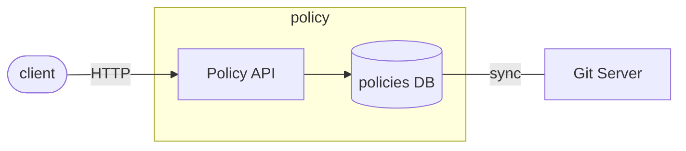
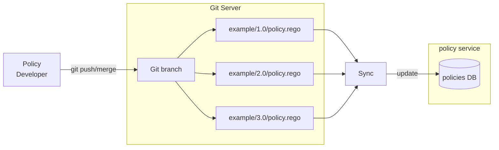

[](https://gitlab.eclipse.org/eclipse/xfsc/tsa/policy/-/commits/main)
[](https://gitlab.eclipse.org/eclipse/xfsc/tsa/policy/-/commits/main)

# Policy Service
This project has been migrated to Eclipse Foundation, and it can be found under https://gitlab.eclipse.org/eclipse/xfsc/

The policy service provides HTTP API to evaluate/execute 
[OPA](https://www.openpolicyagent.org/) policies.

It is developed using the [Goa v3](https://goa.design/) framework
and uses the [Go OPA framework](https://github.com/open-policy-agent/opa) 
as a library.

[Swagger OpenAPI documentation](https://gitlab.eclipse.org/eclipse/xfsc/tsa/policy/-/blob/main/gen/http/openapi3.json)

In the local docker-compose environment, the Swagger URL is available at http://localhost:8081/swagger-ui/ 

### High-level Overview



### Policy Evaluation

The policy service exposes HTTP endpoints to evaluate/execute policies.
The endpoint interface is conformant to the TSA requirements document.

To evaluate a policy a GET or POST request is sent to the evaluation URL.
The example URL below is given for the local docker-compose environment. 
The `host` and `port` parts will be different for the different environments.

```
# URL with example policy repository, group, name and version
http://localhost:8081/policy/policies/xfsc/didresolve/1.0/evaluation

# URL with parameter placeholders
http://localhost:8081/policy/{repository}/{group}/{policy}/{version}/evaluation
```

There are four parameters in the URL specifying which exact policy 
should be evaluated - `repository`, `group`, `policy` and `version`. These parameters 
are also important during policy development (see below) as `group` 
and `policy` **must** be used as package name inside the policy 
source code file.

The body of the POST request can be empty, but if it's not empty, it 
**must** be JSON. It is passed directly to the policy execution runtime. 
Inside the policy it is accessed with the global variable name `input`. 
For example, if you pass to the evaluation endpoint the following JSON, 
it will be accessible by `input.message`:
```json
{
  "message": "hello world"
}
```

Here is a complete example CURL request:
```shell
curl -X POST http://localhost:8081/policy/policies/xfsc/didresolve/1.0/evaluation -d '{"message":"hello world"}'
```

### Policy Locking

The service exposes HTTP endpoints to lock and unlock policies. Locking a policy
means that it's not allowed for evaluation (execution). Unlocking a policy allows
its evaluation/execution to proceed normally.

Lock a policy with POST request:
```shell
curl -X POST http://localhost:8081/policy/policies/xfsc/didresolve/1.0/lock
```

Unlock a policy with DELETE request:
```shell
curl -X DELETE http://localhost:8081/policy/policies/xfsc/didresolve/1.0/lock
```

### Policy Bundles

A policy bundle contains a Policy source code, static data, configuration and some
additional meta-info necessary for verifying the origin of the policy (who signed the bundle).

The service allows to export a policy bundle by making HTTP request against a policy URL
of the same format as is used for evaluation, but instead of using the `evaluation` word
at the end, you replace it with `export`. That will pack the policy as ZIP bundle, 
and the ZIP bundle will be returned to the client.

```shell
wget http://localhost:8081/repository/policy/xfsc/didresolve/1.0/export
```

>See [here](./doc/policy_bundles.md) for more detailed overview of 
>policy bundles export/import.

### Policy Storage

Policies (rego source code and metadata) are stored in a storage, which is an interface
and different implementations could be used. You can check the interface
[here](./internal/service/policy/storage.go).

Currently, there are two implementations of the storage interface:
 - [MongoDB](./doc/mongodb_storage.md)
 - [Memory](./doc/memory-storage.md)

In order to use another storage technology, one should implement the [Storage interface](./internal/service/policy/storage.go).



### Policy Development

* [Policy Extensions Functions](./doc/policy_development.md)

Policies are written in the [Rego](https://www.openpolicyagent.org/docs/latest/policy-language/) 
language. Please refer to the [OPA documentation](https://www.openpolicyagent.org/docs/latest/)
for detailed overview of Rego and OPA capabilities.

**Some conventions *must* be followed when writing policies.**

1. The filename of the policy *must* follow rules for the naming and directory structure:
the `group`, `policy name` and `version` are directories inside the Git repo and policy file *must* be named
`policy.rego`.  For example: `/xfsc/example/1.0/policy.rego`.
2. In the same directory there could be a data file containing static JSON, which is automatically 
available for use during policy evaluation by using the `data` variable. The file *must* be named `data.json`. 
Example: `/xfsc/example/1.0/data.json`
3. In the same directory there could be a configuration file containing information for getting static JSON
data from external URL. The file *must* be named `data-config.json`.
Example: `/xfsc/example/1.0/data-config.json`
> Note that there should only be one of the two files `data.json` or `data-config.json` in the same directory.
> If both files exist in the same directory tha data from the `data.json` file will be eventually overwritten by the data
> acquired using the configuration from the `data-config.json` file.
4. In the same directory there could be a configuration file containing JSON schema for validating the policy
evaluation output. The file *must* be named `output-schema.json`.
Example: `/xfsc/example/1.0/output-schema.json`
5. The policy package name inside the policy source code file *must* exactly match
the `group` and `policy` (name) of the policy.

##### *What does it mean?*

- Let's see an example for the 1st convention.
```
package xfsc.example

allow {
    input.message == "hello world"
}
```

Next, the filename must be `/xfsc/example/1.0/policy.rego`. When such file is synchronized
with the policy service (storage), the naming convention allows the service to understand
which part is the policy group, which part is policy name and which part is version.

If we create the above policy and store it in the Git repo as `/xfsc/example/1.0/policy.rego`,
after the Git server is synchronized with the Policy Storage, the policy service will
automatically expose URLs for working with the policy at:
```
http://localhost:8081/policy/xfsc/example/1.0/evaluation
http://localhost:8081/policy/xfsc/example/1.0/lock
```
- The 2nd rule for static data file naming is to make sure that file `/xfsc/example/1.0/data.json`
is passed and is available to the evaluation runtime when a policy is evaluated at URL:
```
http://localhost:8081/policy/xfsc/example/1.0/evaluation
```
Static data is accessed within the Rego policy with `data.someKey`.
Example: If the `/xfsc/example/1.0/data.json` file is:
```json
{
  "name": "some name"
}
```
one could access the data using `data.name` within the Rego source code.

- The 3rd rule for configuration file is to provide configurations for getting static JSON data from external URL.
The file must contain a URL, an HTTP method and a period, after which an HTTP request is made to get the latest data.
> The period must be added as duration e.g. `10h`, `1h30m` etc.

The file MAY contain body for the request.
Example file contents:
```json
{
  "url": "http://example.com/data.json?page=3",
  "method": "GET",
  "period": "10h",
  "body": {
    "key": "value"
  }
}
```
This means that every 10 hours an HTTP request is going to be made on the given URL, with `GET` method and the result is going
to be stored as static data for this policy and passed during evaluation.

- The 4th rule for policy output schema validation is to provide a JSON schema which will be
used to validate the output of the policy.

Example file contents:
```json
{
  "type": "object",
  "properties": {
    "foo": {
      "type": "string",
      "minLength": 5
    }
  }
}
```

This policy output would be valid: `{"foo":"barbaz"}`.
This policy output would be invalid: `{"foo":"bar"}`.

- The 5th rule for package naming is needed so that a generic evaluation function
can be mapped and used for evaluating all kinds of different policies. Without a 
package naming rule, there's no way the service can automatically generate HTTP 
endpoints for working with arbitrary dynamically uploaded policies.

### Access HTTP Headers inside a policy

HTTP request headers are passed to the evaluation runtime on each request. They can be
accessed through a built-in extension function named `external.http.header()`. It accepts as argument
the name of the header in [Canonical](https://golangbyexample.com/canonical-http-header-key/) 
format. For example, inside Rego the value of a header named `Authorization` can be retrieved
as follows:
```
package example.example

auth := external.http.header("Authorization")
```

>Header names are passed to the Rego runtime in Canonical format. This means that the 
>first character and any characters following a hyphen are uppercase and the rest 
>are lowercase.

More examples, if the policy service receive a request with the following headers:
```
accept-encoding: gzip, deflate
Accept-Language: en-us
fOO: Bar
x-loCATion: Baz
```
Inside a policy these headers could be accessed as follows:
```
accept_encoding := external.http.header("Accept-Encoding")
accept_language := external.http.header("Accept-Language")
foo := external.http.header("Foo")
location := external.http.header("X-Location")
```

### Policy Extensions Functions

A brief documentation for the available Rego extensions functions
which can be used during policy development.

[Policy Extensions Functions](./doc/policy_development.md)

You can also look at the source code in package [`regofunc`](./internal/regofunc) to understand the
inner-working and capabilities of the extension functions.

### GDPR

[GDPR](GDPR.md)

### Dependencies

[Dependencies](go.mod)

### License

[Apache 2.0 license](LICENSE)
