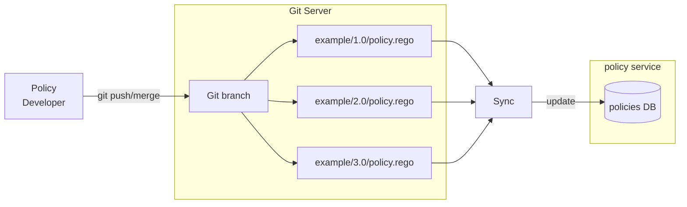

[](https://gitlab.eclipse.org/eclipse/xfsc/tsa/policy/-/commits/main)
[](https://gitlab.eclipse.org/eclipse/xfsc/tsa/policy/-/commits/main)

# Policy Service

The policy service provides REST API to evaluate/execute 
[OPA](https://www.openpolicyagent.org/) policies written in
the Rego language. The policy engine is extended with custom 
functions available for use through the Rego runtime during
policy execution. The service also provides endpoints for exporting
and importing policy bundles, for subscribing for policy changes and endpoints for policy
administration (e.g. listing policies, lock/unlock specific policy).

It is developed using the [Goa v3](https://goa.design/) framework
and uses the [Go OPA framework](https://github.com/open-policy-agent/opa) 
as a library.

> A helper script named `goagen.sh` can be found inside the root directory of
> the service. It can be used to generate the transport layer code from the
> Goa DSL definitions in the [design](./design) directory. The script should
> be executed everytime the design definitions are updated. It also generates
> updated OpenAPI documentation from the DSL.

[OpenAPI documentation](https://gitlab.eclipse.org/eclipse/xfsc/tsa/policy/-/blob/main/gen/http/openapi3.json)

In the local docker-compose environment, the Swagger URL is available at http://localhost:8081/swagger-ui/ 

### High-level Overview


### Configuration

The Policy service is configured using the [Configuration File](./internal/config/config.go).
All configurations are expected as Environment variables specified in the
configuration file. For managing the configuration data from ENV variables,
[envconfig library](https://github.com/kelseyhightower/envconfig) is used.


### Policy Evaluation

The policy service exposes HTTP endpoints to evaluate/execute policies.
The endpoint interface is conformant to the TSA requirements document.

To evaluate a policy a GET or POST request is sent to the evaluation URL.
The example URL below is given for the local docker-compose environment. 
The `host` and `port` parts will be different for the different environments.

```
# URL with example policy repository, group, name and version
http://localhost:8081/policy/policies/xfsc/didresolve/1.0/evaluation

# URL with parameter placeholders
http://localhost:8081/policy/{repository}/{group}/{policy}/{version}/evaluation
```

There are four parameters in the URL specifying which exact policy 
should be evaluated - `repository`, `group`, `policy` and `version`. These parameters 
are also important during policy development (see below) as `group` 
and `policy` **must** be used as package name inside the policy 
source code file.

The body of the POST request can be empty, but if it's not empty, it 
**must** be JSON. It is passed directly to the policy execution runtime. 
Inside the policy it is accessed with the global variable name `input`. 
For example, if you pass to the evaluation endpoint the following JSON, 
it will be accessible by `input.message`:
```json
{
  "message": "hello world"
}
```

Here is a complete example CURL request:
```shell
curl -X POST http://localhost:8081/policy/policies/xfsc/didresolve/1.0/evaluation -d '{"message":"hello world"}'
```

### Policy output JSON schema validation

The policy service exposes HTTP endpoint to validate the output of the policy. It uses
[JSON Schema](https://json-schema.org/) to validate the JSON schema of the output
of the policy. To execute the validation procedure, a new HTTP URL is automatically generated.

```
Evaluation URL pattern: {service_addr}/{repo}/{group}/{policyname}/{version}/evaluation
Validation URL pattern: {service_addr}/{repo}/{group}/{policyname}/{version}/validation
```

In order to use the validation endpoint, `output-schema.json` file following the [JSON Schema](https://json-schema.org/)
specification must be present in the policy repository directory. For more information on policy development refer to:
[Policy Development](#Policy-Development)

### Policy Locking

The service exposes HTTP endpoints to lock and unlock policies. Locking a policy
means that it's not allowed for evaluation (execution). Unlocking a policy allows
its evaluation/execution to proceed normally.

Lock a policy with POST request:
```shell
curl -X POST http://localhost:8081/policy/policies/xfsc/didresolve/1.0/lock
```

Unlock a policy with DELETE request:
```shell
curl -X DELETE http://localhost:8081/policy/policies/xfsc/didresolve/1.0/lock
```

### Policy Bundles

A policy bundle contains a Policy source code, static data, configuration and some
additional meta-info necessary for verifying the origin of the policy (who signed the bundle).

The service allows to export a policy bundle by making HTTP request against a policy URL
of the same format as is used for evaluation, but instead of using the `evaluation` word
at the end, you replace it with `export`. That will pack the policy as ZIP bundle, 
and the ZIP bundle will be returned to the client.

```shell
wget http://localhost:8081/repository/policy/xfsc/didresolve/1.0/export
```

>See [here](./doc/policy_bundles.md) for more detailed overview of 
>policy bundles export/import.

### Policy Storage

Policies (rego source code and metadata) are stored in a storage, which is an interface
and different implementations could be used. You can check the interface
[here](./internal/service/policy/storage.go).

Currently, there are two implementations of the storage interface:
 - [MongoDB](./doc/mongodb_storage.md)
 - [Memory](./doc/memory-storage.md)

Matrix for storage feature availability:

 **Feature** | **MongoDB** | **Memory**
--- |--------|------------
Policy Lock/Unlock | Yes    | Yes*
Change Notifications | Yes    | Yes*
Storage extension functions | Yes | Yes*
Automatic synchronization | Yes | N/A
Bundle import/export | Yes | Yes*

> `*` Functionality is available only for the current instance of the policy service. Synchronization between
> instances of the policy service is not available.

In order to use another storage technology, one should implement the [Storage interface](./internal/service/policy/storage.go).



### Subscribe for Policy Changes

The service allows external clients to subscribe for policy changes.
A change event happens when policy source code, static data, export configuration or
any state-related data is updated. Two subscription mechanisms are supported.

##### Cloud Events  

When policy change event happens, a cloud event is sent using the CloudEvents Go SDK.
It uses standard format for encoding/decoding events and typically uses a message
queue under the hood for delivery of events. Our implementation is using NATS, but
any broker supporting the CloudEvents specification should work. 

##### Web Hooks

This mechanism allow clients to express interest in change events for a specific policy
and when such change event is triggered, the policy service shall notify the client.
A client subscribes for policy change by making an HTTP request to a policy endpoint
with the suffix `notifychage`, for example:
```
$ curl https://mysvc.com/policy/policies/example/policyname/1.0/notifychange 
-d '{"webhook_url":"https://url-to-call-when-policy-changes.com"}'
```

This request creates a record in storage, so the Policy service will know which 
webhook URL to call when a policy change event happens. 

The event type that will be received by the subscriber is per policy and is sent
as JSON structure like:
```json
{
  "repository": "policies",
  "group": "example",
  "name" : "mypolicy",
  "version": "1.0"
}
```
It is defined in [notify.go](./internal/notify/notify.go)

### Policy Admin API

The API allows to inspect the internal state of the policies without requiring
direct access to the policy database. This could be useful for debugging or checking
what is the current source code or static data for a given policy. The endpoint is called
with HTTP GET requests and supports basic filtering and expansion via query params:
```
GET /v1/policies?policyName=hello&locked=true&rego=true&data=true&dataConfig=true
```

> All query parameters are optional.

### Policy Development

* [Policy Extensions Functions](./doc/policy_development.md)

Policies are written in the [Rego](https://www.openpolicyagent.org/docs/latest/policy-language/) 
language. Please refer to the [OPA documentation](https://www.openpolicyagent.org/docs/latest/)
for detailed overview of Rego and OPA capabilities.

**Some conventions *must* be followed when writing policies.**

1. The filename of the policy *must* follow rules for the naming and directory structure:
the `group`, `policy name` and `version` are directories inside the Git repo and policy file *must* be named
`policy.rego`.  For example: `/xfsc/example/1.0/policy.rego`.
2. In the same directory there could be a data file containing static JSON, which is automatically 
available for use during policy evaluation by using the `data` variable. The file *must* be named `data.json`. 
Example: `/xfsc/example/1.0/data.json`
3. In the same directory there could be a configuration file containing information for getting static JSON
data from external URL. The file *must* be named `data-config.json`.
Example: `/xfsc/example/1.0/data-config.json`
> Note that there should only be one of the two files `data.json` or `data-config.json` in the same directory.
> If both files exist in the same directory tha data from the `data.json` file will be eventually overwritten by the data
> acquired using the configuration from the `data-config.json` file.
4. In the same directory there could be a configuration file containing JSON schema for validating the policy
evaluation output. The file *must* be named `output-schema.json`.
Example: `/xfsc/example/1.0/output-schema.json`
5. The policy package name inside the policy source code file *must* exactly match
the `group` and `policy` (name) of the policy.

##### *What does it mean?*

- Let's see an example for the 1st convention.
```
package xfsc.example

allow {
    input.message == "hello world"
}
```

Next, the filename must be `/xfsc/example/1.0/policy.rego`. When such file is synchronized
with the policy service (storage), the naming convention allows the service to understand
which part is the policy group, which part is policy name and which part is version.

If we create the above policy and store it in the Git repo as `/xfsc/example/1.0/policy.rego`,
after the Git server is synchronized with the Policy Storage, the policy service will
automatically expose URLs for working with the policy at:
```
http://localhost:8081/policy/xfsc/example/1.0/evaluation
http://localhost:8081/policy/xfsc/example/1.0/lock
```
- The 2nd rule for static data file naming is to make sure that file `/xfsc/example/1.0/data.json`
is passed and is available to the evaluation runtime when a policy is evaluated at URL:
```
http://localhost:8081/policy/xfsc/example/1.0/evaluation
```
Static data is accessed within the Rego policy with `data.someKey`.
Example: If the `/xfsc/example/1.0/data.json` file is:
```json
{
  "name": "some name"
}
```
one could access the data using `data.name` within the Rego source code.

- The 3rd rule for configuration file is to provide configurations for getting static JSON data from external URL.
The file must contain a URL, an HTTP method and a period, after which an HTTP request is made to get the latest data.
> The period must be added as duration e.g. `10h`, `1h30m` etc.

The file MAY contain body for the request.
Example file contents:
```json
{
  "url": "http://example.com/data.json?page=3",
  "method": "GET",
  "period": "10h",
  "body": {
    "key": "value"
  }
}
```
This means that every 10 hours an HTTP request is going to be made on the given URL, with `GET` method and the result is going
to be stored as static data for this policy and passed during evaluation.

- The 4th rule for policy output schema validation is to provide a JSON schema which will be
used to validate the output of the policy.

Example file contents:
```json
{
  "type": "object",
  "properties": {
    "foo": {
      "type": "string",
      "minLength": 5
    }
  }
}
```

This policy output would be valid: `{"foo":"barbaz"}`.
This policy output would be invalid: `{"foo":"bar"}`.

- The 5th rule for package naming is needed so that a generic evaluation function
can be mapped and used for evaluating all kinds of different policies. Without a 
package naming rule, there's no way the service can automatically generate HTTP 
endpoints for working with arbitrary dynamically uploaded policies.

### Access HTTP Headers inside a policy

HTTP request headers are passed to the evaluation runtime on each request. They can be
accessed through a built-in extension function named `external.http.header()`. It accepts as argument
the name of the header in [Canonical](https://golangbyexample.com/canonical-http-header-key/) 
format. For example, inside Rego the value of a header named `Authorization` can be retrieved
as follows:
```
package example.example

auth := external.http.header("Authorization")
```

>Header names are passed to the Rego runtime in Canonical format. This means that the 
>first character and any characters following a hyphen are uppercase and the rest 
>are lowercase.

More examples, if the policy service receive a request with the following headers:
```
accept-encoding: gzip, deflate
Accept-Language: en-us
fOO: Bar
x-loCATion: Baz
```
Inside a policy these headers could be accessed as follows:
```
accept_encoding := external.http.header("Accept-Encoding")
accept_language := external.http.header("Accept-Language")
foo := external.http.header("Foo")
location := external.http.header("X-Location")
```

### Policy Extensions Functions

A brief documentation for the available Rego extensions functions
which can be used during policy development.

[Policy Extensions Functions](./doc/policy_development.md)

You can also look at the source code in package [`regofunc`](./internal/regofunc) to understand the
inner-working and capabilities of the extension functions.

### Build

##### Local binary
To make the service binary locally, you can run the following command from the root
directory (you must have [Go](https://go.dev/) installed):
```shell
go build -o policy ./cmd/policy/...
```

##### Docker image

You can see the Dockerfile of the service under the [deployment](./deployment) directory.
There is one Dockerfile for use during local development with docker-compose and one for
building an optimized production image: [deployment/ci/Dockerfile](./deployment/ci/Dockerfile).

### Versioning

There is one global exported variable named `Version` in `main.go`. The variable is set 
to the latest tag or commit hash during the build process. You can look in the production 
Dockerfile to see how the Version is set during build. The version is printed in the service 
log on startup and can be used to verify which specific commit of the code is deployed.

> Version should *not* be set or modified manually in the source code.

### Logging

The service outputs all logs to `stdout` as defined by the best practices in the Cloud Native
community. See here for more details [12 Factor App](https://12factor.net/logs).
From there logs could be processed as needed in the specific running environment.
The standard log levels are `[debug,info,warn,error,fatal`] and `info` is the default level.
If you want to set another log level, use the ENV configuration variable `LOG_LEVEL` to set it.

### GDPR

[GDPR](GDPR.md)

### Dependencies

[Dependencies](go.mod)

### Deployment

[Helm deployment documentation](deployment/helm/README.md)

### License

[Apache 2.0 license](LICENSE)
