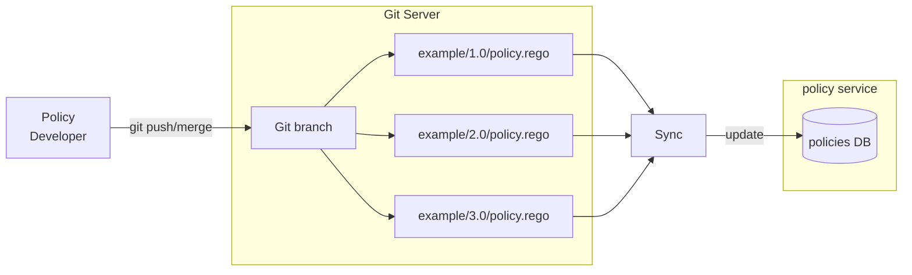

[](https://gitlab.com/gaia-x/data-infrastructure-federation-services/tsa/policy/-/commits/main)
[](https://gitlab.com/gaia-x/data-infrastructure-federation-services/tsa/policy/-/commits/main)

# Policy Service

The policy service provides HTTP API to evaluate/execute 
[OPA](https://www.openpolicyagent.org/) policies.

It is developed using the [Goa v3](https://goa.design/) framework
and uses the [Go OPA framework](https://github.com/open-policy-agent/opa) 
as a library.

While the service is up and running, you can see a live Swagger API 
description at `servicehost:serviceport/swagger-ui`. In the local docker-compose 
environment, the Swagger URL is available at http://localhost:8081/swagger-ui/ 

### High-level Overview


### Policy Evaluation

The policy service exposes HTTP endpoints to evaluate/execute policies.
The endpoint interface is conformant to the TSA requirements document.

To evaluate a policy a GET or POST request is sent to the evaluation URL.
The example URL below is given for the local docker-compose environment. 
The `host` and `port` parts will be different for the different environments.

```
# URL with example policy group, name and version
http://localhost:8081/policy/gaiax/didresolve/1.0/evaluation

# URL with parameter placeholders
http://localhost:8081/policy/{group}/{policy}/{version}/evaluation
```

There are three parameters in the URL specifying which exact policy 
should be evaluated - `group`, `policy` and `version`. These parameters 
are also important during policy development (see below) as `group` 
and `policy` **must** be used as package name inside the policy 
source code file.

The body of the POST request can be empty, but if it's not empty, it 
**must** be JSON. It is passed directly to the policy execution runtime. 
Inside the policy it is accessed with the global variable name `input`. 
For example, if you pass to the evaluation endpoint the following JSON, 
it will be accessible by `input.message`:
```json
{
  "message": "hello world"
}
```

Here is a complete example CURL request:
```shell
curl -X POST http://localhost:8081/policy/gaiax/didresolve/1.0/evaluation -d '{"message":"hello world"}'
```

### Policy Locking

The service exposes HTTP endpoints to lock and unlock policies. Locking a policy
means that it's not allowed for evaluation (execution). Unlocking a policy allows
its evaluation/execution to proceed normally.

Lock a policy with POST request:
```shell
curl -X POST http://localhost:8081/policy/gaiax/didresolve/1.0/lock
```

Unlock a policy with DELETE request:
```shell
curl -X DELETE http://localhost:8081/policy/gaiax/didresolve/1.0/lock
```

### Policy Storage

Policies (rego source code and metadata) are stored in a MongoDB collection `policies`,
with one collection document representing one policy. A document contains additional 
policy state un-related to OPA and Rego, but necessary for implementing the TSA 
requirements (e.g. policy lock/unlock).

The database is used as read-only source of truth for the current policy state when
policies need to be evaluated. Policy storage is updated externally from a separate
component. The update process is automatically triggered by updating policy source 
code files in an external Git server.



### Policy Development

* [Policy Extensions Functions](./doc/policy_development.md)

Policies are written in the [Rego](https://www.openpolicyagent.org/docs/latest/policy-language/) 
language. Please refer to the [OPA documentation](https://www.openpolicyagent.org/docs/latest/)
for detailed overview of Rego and OPA capabilities.

**Some conventions *must* be followed when writing policies.**

1. The filename of the policy *must* follow rules for the naming and directory structure:
the `group`, `policy name` and `version` are directories inside the Git repo and policy file *must* be named
`policy.rego`.  For example: `/gaiax/example/1.0/policy.rego`.
2. In the same directory there could be a data file containing static JSON, which is automatically 
available for use during policy evaluation by using the `data` variable. The file *must* be named `data.json`. 
Example: `/gaiax/example/1.0/data.json`
3. The policy package name inside the policy source code file *must* exactly match
the `group` and `policy` (name) of the policy.

*What does it mean?*

Let's see an example for the 1st convention.
```
package gaiax.example

allow {
    input.message == "hello world"
}
```

Next, the filename must be `/gaiax/example/1.0/policy.rego`. When such file is synchronized
with the policy service (storage), the naming convention allows the service to understand
which part is the policy group, which part is policy name and which part is version.

If we create the above policy and store it in the Git repo as `/gaiax/example/1.0/policy.rego`,
after the Git server is synchronized with the Policy Storage, the policy service will
automatically expose URLs for working with the policy at:
```
http://localhost:8081/policy/gaiax/example/1.0/evaluation
http://localhost:8081/policy/gaiax/example/1.0/lock
```
The 2nd rule for static data file naming is to make sure that file `/gaiax/example/1.0/data.json`
is passed and is available to the evaluation runtime when a policy is evaluated at URL:
```
http://localhost:8081/policy/gaiax/example/1.0/evaluation
```
Static data is accessed within the Rego policy with `data.someKey`.
Example: If the `/gaiax/example/1.0/data.json` file is:
```json
{
  "name": "some name"
}
```
one could access the data using `data.name` within the Rego source code.

The 3rd rule for package naming is needed so that a generic evaluation function
can be mapped and used for evaluating all kinds of different policies. Without a 
package naming rule, there's no way the service can automatically generate HTTP 
endpoints for working with arbitrary dynamically uploaded policies.

### Access HTTP Headers inside a policy

HTTP request headers are passed to the evaluation runtime on each request. They can be
accessed through a built-in extension function named `get_header()`. It accepts as argument
the name of the header in [Canonical](https://golangbyexample.com/canonical-http-header-key/) 
format. For example, inside Rego the value of a header named `Authorization` can be retrieved
as follows:
```
package example.example

auth := get_header("Authorization")
```

>Header names are passed to the Rego runtime in Canonical format. This means that the 
>first character and any characters following a hyphen are uppercase and the rest 
>are lowercase.

More examples, if the policy service receive a request with the following headers:
```
accept-encoding: gzip, deflate
Accept-Language: en-us
fOO: Bar
x-loCATion: Baz
```
Inside a policy these headers could be accessed as follows:
```
accept_encoding := get_header("Accept-Encoding")
accept_language := get_header("Accept-Language")
foo := get_header("Foo")
location := get_header("X-Location")
```

### Policy Extensions Functions

A brief documentation for the available Rego extensions functions
which can be used during policy development.

[Policy Extensions Functions](./doc/policy_development.md)

You can also look at the source code in package [`regofunc`](./internal/regofunc) to understand the
inner-working and capabilities of the extension functions.

### GDPR

[GDPR](GDPR.md)

### Dependencies

[Dependencies](go.mod)

### License

[Apache 2.0 license](LICENSE)
